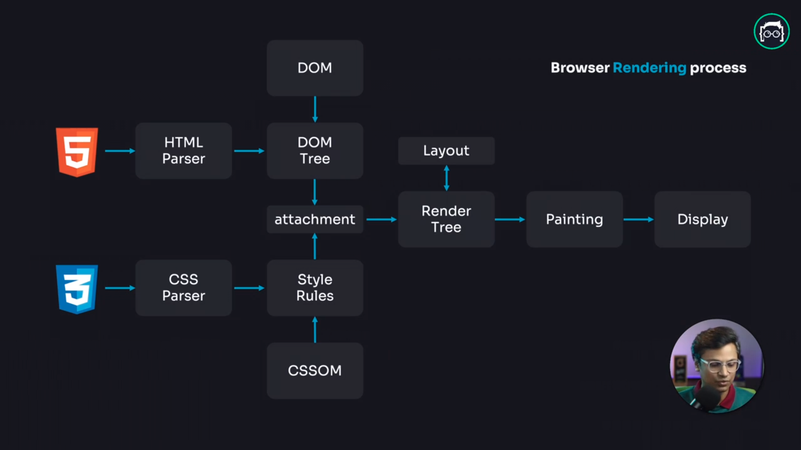
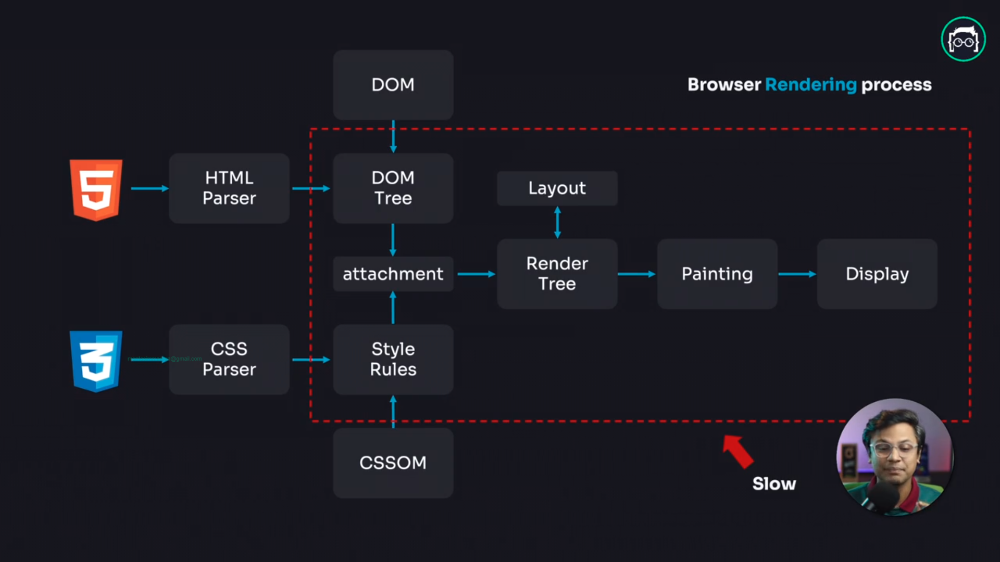
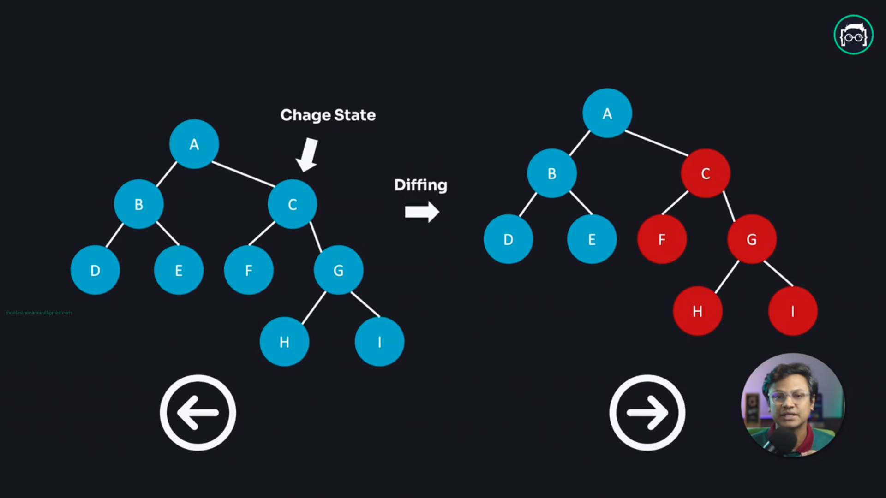
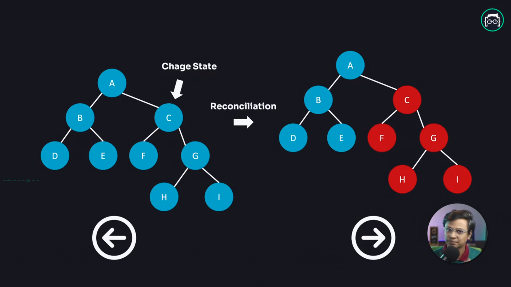
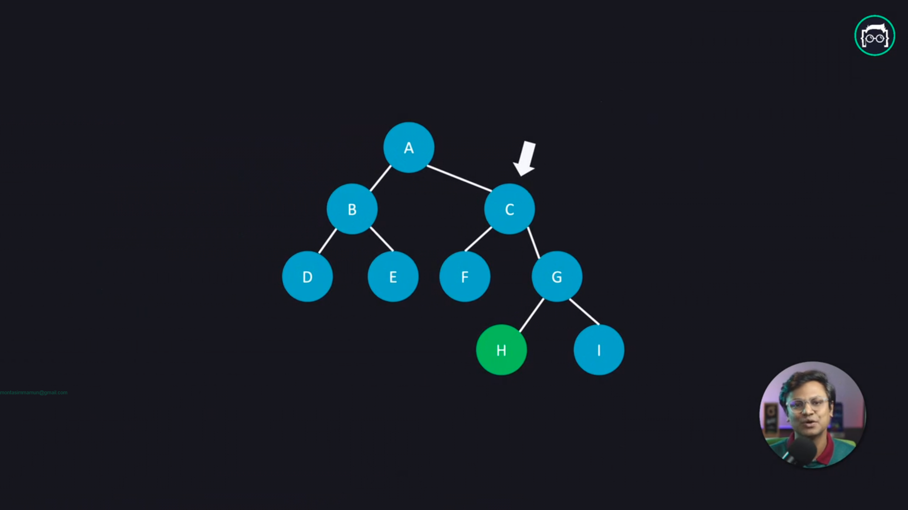

## [Module 1 - Getting Started with React: Describing the UI](module-1.md)

<br/>

### Table of Contents

- [Lesson](#lesson)

<br/>

### Lesson

[1.1 Introduction to React](#11-introduction-to-react)

[1.2 React Installation & Development Environment Setup](#12-react-installation-development-environment-setup)

[1.3 How React works: Virtual DOM](#13-how-react-works-virtual-dom)

[1.4 - Basics of React Components: Your first component](#14---basics-of-react-components-your-first-component)

[1.5 - Basics of React Components: Importing & Exporting Components](#15---basics-of-react-components-importing-exporting-components)

[1.6 - Basics of JSX: React's Markup - Writing Markup with JSX](#16---basics-of-jsx-reacts-markup---writing-markup-with-jsx)

[1.7 - Basics of JSX: React's Markup - JavaScript in JSX with Curly Braces](#17---basics-of-jsx-reacts-markup---javascript-in-jsx-with-curly-braces)

[1.8 - Understanding Props - Passing Props to a Component](#18---understanding-props---passing-props-to-a-component)

[1.9 - Conditional Rendering](#19---conditional-rendering)

[1.10 Rendering Lists](#110-rendering-lists)

[1.11 Pure Components: Keeping Components Pure](#111-pure-components-keeping-components-pure)

[1.12 Understanding Complex React UI](#112-understanding-complex-react-ui)

[1.13 Project Tutorial - Tic-Tac-Toe Game](#113-project-tutorial---tic-tac-toe-game)

[Assignment 1 Requirements - SmartGrade Showcase](#assignment-1-requirements---smartgrade-showcase)

<br/>
<br/>

### 1.1 Introduction to React

<br/>

1. What is React?

   **Answer:** The library for web and native user interfaces. Focused on user interface.

2. Why React?

   **Answer:** If the data changed then the UI needs to be update manually. For medium or larger application this could be very complex, time consuming and easier to make mistake while changing the data. To overcome these problem we use React.

3. History of React?

   **Answer:** Jordan Walke, who was an engineer of Facebook created React. React was inspired by a component based PHP framework XHP-JS. First implemented on Facebook news feed on 2011. Used on Instagram on 2012. When they finds out that it could be very useful then they made it open source on 2013.

4. Why React is called React?

   **Answer:** When updating the data, without manually updating the UI, React automatically update the UI. That is why it is called React.
   **Answer:** Jordan Walke, who was an engineer of Facebook created React. React was inspired by a component based PHP framework XHP-JS. First implemented on Facebook news feed on 2011. Used on Instagram on 2012. When they finds out that it could be very useful then they made it open source on 2013.

5. Why Babel is needed?

   **Answer:** React introduced a new way to write JavaScript, HTML and CSS in a single file named JSX (JavaScript XML) which is not a W3 standard. So, browser does not understand that. Babel take the responsibility to transpile the React content to browser.

<br/>

### 1.2 React Installation & Development Environment Setup

<br/>

1. Create a Vite template for React?

   **Answer:** `npm create vite@latest`

2. Visual Studio Code Settings

   **Answer:**

   ```json
   {
     "editor.defaultFormatter": "esbenp.prettier-vscode",
     "editor.formatOnSave": true,
     "editor.codeActionsOnSave": {
       "source.fixAll.eslint": "explicit",
       "source.fixAll.tslint": "explicit",
       "source.organizeImports": "explicit"
     },
     "eslint.run": "onSave",
     "emmet.includeLanguages": {
       "javascript": "javascriptreact"
     },
     "path-autocomplete.extensionOnImport": true,
     "path-autocomplete.excludedItems": {
       "*/.js": {
         "when": "**"
       },
       "*/.jsx": {
         "when": "**"
       }
     },
     "javascript.validate.enable": false,
     "typescript.validate.enable": false
   }
   ```

3. Visual Studio Code Snippets

   **Answer:**

   ```json
   {
     "React component": {
       "prefix": "rfc",
       "body": [
         "export default function $1(){",
         "    return (",
         "        $2",
         "    );",
         "}"
       ],
       "description": "React functional component"
     }
   }
   ```

4. How to open Visual Studio Code terminal

   **Answer:** `CTRL + ~`

5. How to open Visual Studio Code command pannel

   **Answer:** `CTRL + SHIFT + ~`

<br/>

### 1.3 How React works: Virtual DOM

<br/>

1. Is DOM really slow?

   **Answer:** No. DOM is fast enought. To change anything to a JavaScript, the amount of work associate with it, is likely the same to change anything to DOM. After a DOM is loaded, if anything needs to be changed on the DOM then the process of generating render tree happens again. Actually DOM is not slow, the painting process is slow.

2. Browser rendering process

   **Answer:**

   Process of initial DOM rendering

   

   Process of chaning on the DOM

   

3. What is the best we can do about this slow painting process?

   **Answer:**

4. Batch Update

   **Answer:**

- Create a batch for everything and update everything at a time

5. Less DOM operation

   **Answer:**

   1. 
   1. 
   1. 

6. Is Virtual DOM really slow?

   **Answer:**

   
   

7. Why React is so popular?

   **Answer:** Not only use for it's performance. Compared to Vanilla JavaScript, JQuery, Sevlet, performance of React is not that good enough. But code suggestions, resource, documentaion, developer experience, community, maintainibility and overall performance React is much much better than other available options.

<br/>

### 1.4 - Basics of React Components: Your first component

<br/>

1. What is a React Component?

   **Answer:** Components are one of the core concepts of React. They are the foundation upon which you build user interfaces (UI), which makes them the perfect place to start your React journey!

2. Why use React Component?

   **Answer:** Reusable UI elements for your app.

<br/>

### 1.5 - Basics of React Components: Importing & Exporting Components

<br/>

1.  How to use React Component?

    **Answer:** Create and use standalone React component and use it. When creating or moving a componet must have it's all the functionality.

2.  Type of export on React?

    **Answer:**

    1.  Default export

        ```js
        export default function Gallery() {
          return (
            <section>
              <h1>Amazing scientists</h1>
              <Profile />
              <Profile />
              <Profile />
            </section>
          );
        }
        ```

    2.  Named export

        ```js
        export function Gallery() {
          return (
            <section>
              <h1>Amazing scientists</h1>
              <Profile />
              <Profile />
              <Profile />
            </section>
          );
        }
        ```

3.  Import alias

    **Answer:**

    ```js
    import Gallery, { Card as Image } from "./components/Gallery";
    ```

<br/>

### 1.6 - Basics of JSX: React's Markup - Writing Markup with JSX

<br/>

### 1.7 - Basics of JSX: React's Markup - JavaScript in JSX with Curly Braces

<br/>

### 1.8 - Understanding Props - Passing Props to a Component

<br/>

1.  Why props are immutable?

    **Answer:** Props are immutable—a term from computer science meaning “unchangeable”. When a component needs to change its props (for example, in response to a user interaction or new data), it will have to “ask” its parent component to pass it different props—a new object! Its old props will then be cast aside, and eventually the JavaScript engine will reclaim the memory taken by them.

2.  How to change props value?

    **Answer:** Do not change props value directly from the child component. Change props value from the parent component using the state.

<br/>

### 1.9 - Conditional Rendering

<br/>

1. How to change props value?

   **Answer:** Do not change props value directly from the child component. Change props value from the parent component using the state.

<br/>

### 1.10 Rendering Lists

<br/>

### 1.11 Pure Components: Keeping Components Pure

<br/>

1. What is a pure function?

   **Answer:** A pure function is a function with the following characteristics:

   - It minds its own business. It does not change any objects or variables that existed before it was called.
   - Same inputs, same output. Given the same inputs, a pure function should always return the same result.

   You might already be familiar with one example of pure functions: formulas in math.

   Consider this math formula: y = 2x.

   If x = 2 then y = 4. Always.

   If x = 3 then y = 6. Always.

   If x = 3, y won’t sometimes be 9 or –1 or 2.5 depending on the time of day or the state of the stock market.

   If y = 2x and x = 3, y will always be 6.

   If we made this into a JavaScript function, it would look like this:

   ```js
   function double(number) {
     return 2 * number;
   }
   ```

   In the above example, double is a pure function. If you pass it 3, it will return 6. Always.

2. What is declarative syntax in programming pattern?

   **Answer:**

3. What is Single Responsibility Principle?

   **Answer:**

4. What is hydration?

   **Answer:**

<br/>

### 1.12 Understanding Complex React UI

<br/>

### 1.13 Project Tutorial - Tic-Tac-Toe Game

1. Lifting the state up.

   **Answer:**

<br/>

### [Assignment 1 Requirements - SmartGrade Showcase](https://github.com/montasim/Reactive-Accelerator-Assignment-1)

   [Solution](https://github.com/montasim/Reactive-Accelerator-Assignment-1)
